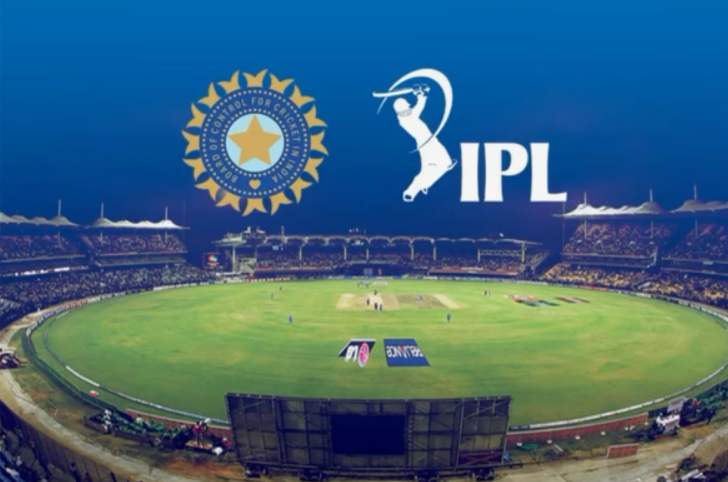

# IPL-score-prediction

Main aim of this project is to build a model which will predict the final score of an IPL match
with the help of certain  using Machine Learning Techniques and Auto ML

## Motivation
In the midst of this pandemic, the IPL has kept us entertained and hooked onto our seats. I myself
being an avid fan of the tournament and the sport, decided to try my hands on a dataset to predict the
runs scored. As we know IPL is one of the biggest flex when it comes to Cricket all over the world.
It would be very exicting to work on a Data Set which gives us the insight of the Data of different matches.

## What will we do?
We will be building a Model which will help us predict the total runs scored in a match with the help of certain Parameters.

In this project we are having a dataset of several different IPL Matches from year 2007-2008.
Information for each ball in the over is given in our Data Set in the form of a row.

## TPOT Auto ML Library
Automated machine learning, also referred to as automated ML or Auto ML, is the process of automating the time-consuming, 
iterative tasks of machine learning model development.

TPOT uses a tree-based structure to represent a model pipeline for a predictive modeling problem, including data preparation and modeling
algorithms and model hyper parameters.

TPOT is a python Automated Machine learning tool that optimezes machine learning pipelines using genetic programming.

## Time Line of the Project
- 1. Data Analysis : Finding out different relations
  2. Feature Engineering : processing the data before the feeding to the model.
  3. Model Building using ML : Using ML/DL Algorithms and TPOT Library
  4. Model Building using Auto ML
